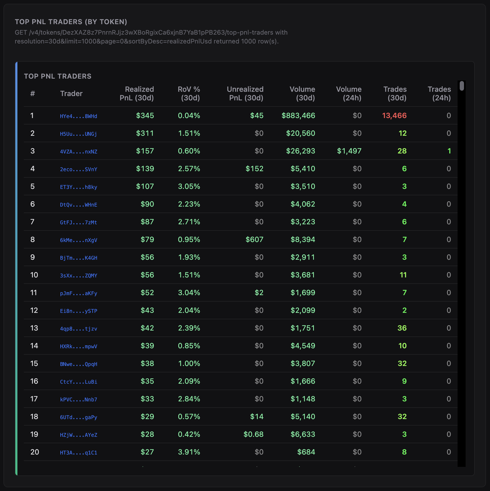
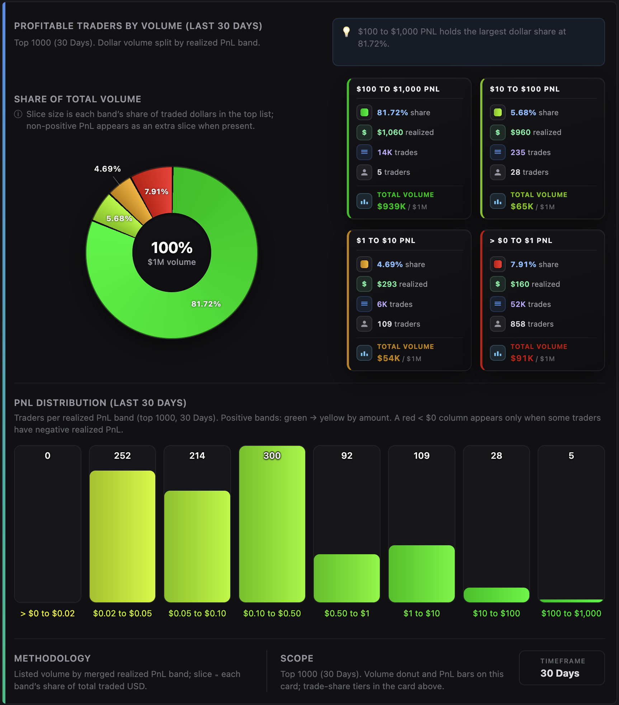
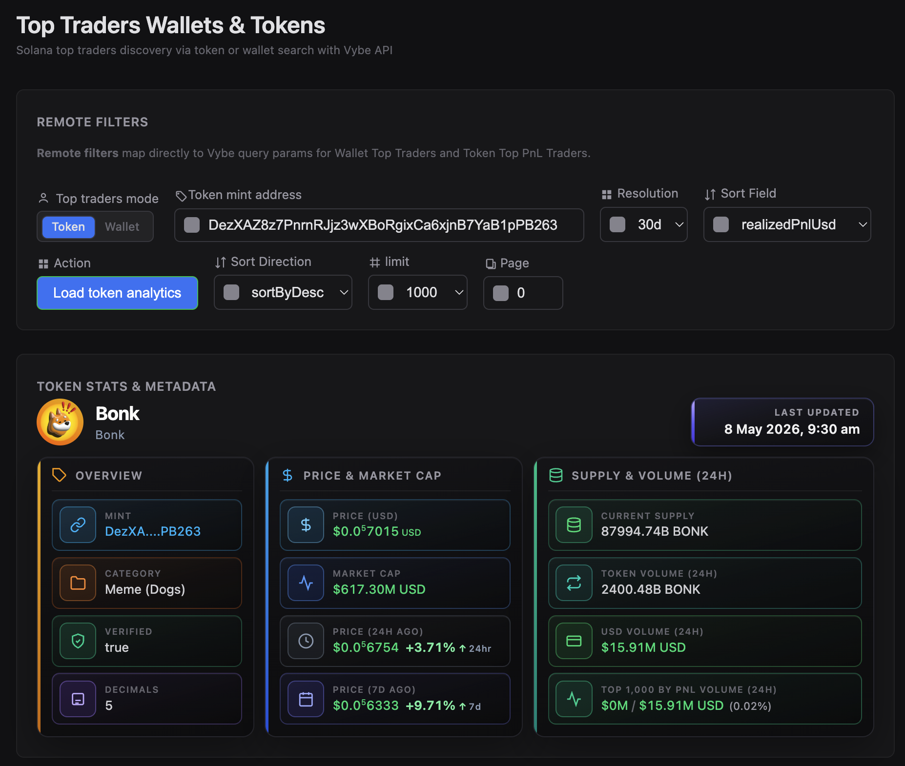
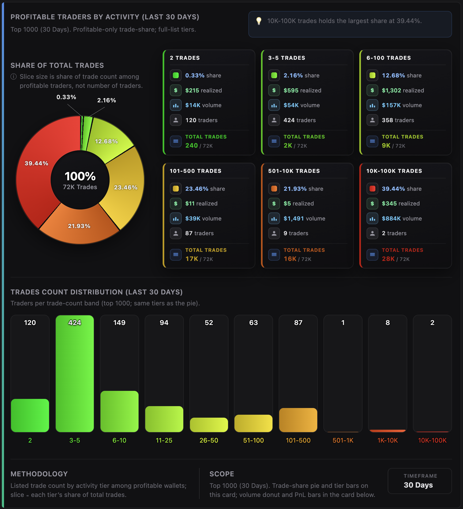

# Solana Top Traders Wallets & Tokens API

This repository demonstrates how to use the Vybe Solana Top Traders and Trades APIs to fetch, rank, and explore high-performing wallets by either token mint (**token mode**) or wallet query (**wallet mode**). It includes a production-ready Node.js backend and a modern frontend that show how to integrate Vybe’s top-trader leaderboard, token metadata, trade context, and holders data to build a practical trader discovery UI.

Try the live demo: https://solana-top-traders-wallets-and-tokens-api.vybenetwork.com

Use this project as a reference implementation or starter kit for building Solana trader discovery tools, wallet intelligence dashboards, and PnL/flow analysis products powered by Vybe’s high-performance Solana data APIs.



<p align="center">
  
  
  
</p>

---

**[Try the LIVE demo →](https://solana-top-traders-wallets-and-tokens-api.vybenetwork.com)**

**[Get your free Vybe API key →](https://vybenetwork.com/pricing)**  

**[Vybe Solana data docs →](https://docs.vybenetwork.com)**

---

## Prerequisites

- **Node.js** ≥ 20 (LTS recommended)
- **npm** ≥ 10 (or equivalent)

## Quick Start

Get from clone to running app in a few commands:

```bash
git clone https://github.com/vybenetwork/solana-top-traders-wallets-and-tokens-api.git
cd solana-top-traders-wallets-and-tokens-api
npm install
cp .env.example .env
# Edit .env and set VYBE_API_KEY=your_api_key_here
npm start
```

Then open **http://localhost:3000**, choose **Token** or **Wallet** mode, and click **Load**.

## Environment Variables

| Variable         | Required | Description                                                     | Example                                |
|------------------|----------|-----------------------------------------------------------------|----------------------------------------|
| `VYBE_API_KEY`   | Yes      | Vybe API key used for all Vybe requests                         | `your_api_key_here`                    |
| `SOLANA_RPC_URL` | No       | RPC endpoint for token-symbol fallbacks (optional)              | `https://api.mainnet-beta.solana.com` |
| `PORT`           | No       | HTTP server port                                                | `3000`                                 |
| `TUNNEL`         | No       | Set to `1` to run behind a Cloudflare Tunnel                     | `1`                                    |

Get your API key at `https://vybenetwork.com/pricing`.

---

## What This Repo Provides

- **Top traders + trades endpoint proxy**
  - Express server that proxies Vybe:
    - `GET /v4/wallets/top-traders` (top traders leaderboard)
    - `GET /v4/trades` (trades context)
    - `GET /v4/programs/labeled-program-accounts` (program labels)
    - `GET /v4/tokens/{mintAddress}` (token metadata)
    - `GET /v4/tokens/{mintAddress}/top-holders` (holder context)
- **Top traders web UI**
  - Single-page GUI (no frameworks) built from `src/frontend/app.ts` into `public/app.js`.
  - Lets you search and rank wallets by token mint or wallet query, sort by key fields, and review supporting token + trade context.
- **Two discovery modes**
  - **Token mode** — leaderboard scoped to a token via `mintAddress`.
  - **Wallet mode** — search via `ilikeFilter` for wallet address/name/label matching.
- **Context panels**
  - Token metadata panel (symbol, name, mint, decimals, price, market cap, volumes when available).
  - Trade context summaries (top programs / markets / quote mints) derived from the latest fetched data.
  - Holders table (top holders by % of supply) for quick holder-side context.

All of this uses Vybe’s production Solana datasets across major DEX venues and aggregated trading activity.

---

### Solana API docs for these endpoints

- **Top traders (`GET /v4/wallets/top-traders`)**:
  - [https://docs.vybenetwork.com](https://docs.vybenetwork.com)
- **Historical trades (`GET /v4/trades`)**:
  - [https://docs.vybenetwork.com/reference/get_trade_data_program_v4](https://docs.vybenetwork.com/reference/get_trade_data_program_v4)
- **Token details (`GET /v4/tokens/{mintAddress}`)**:
  - [https://docs.vybenetwork.com/reference/get_token_details_v4](https://docs.vybenetwork.com/reference/get_token_details_v4)
- **Top holders (`GET /v4/tokens/{mintAddress}/top-holders`)**:
  - [https://docs.vybenetwork.com](https://docs.vybenetwork.com)
- **Labeled programs (`GET /v4/programs/labeled-program-accounts`)**:
  - [https://docs.vybenetwork.com/reference/get_known_program_accounts_v4](https://docs.vybenetwork.com/reference/get_known_program_accounts_v4)

---

## Why Top Traders Data Matters

Top-trader leaderboards are useful for:

- **Trader discovery and intelligence**: find wallets that are consistently profitable (by realized PnL), active, or high-volume.
- **Wallet clustering and follow lists**: start from a wallet query and fan out to related wallets returned by the leaderboard.
- **Token research**: quickly see who is driving PnL and flow for a given mint, and pair it with token metadata and holder context.
- **Program/venue analysis**: use trade context to understand which programs and markets dominate the activity behind the leaderboard.

This repo shows how to build a **practical top-traders explorer** on top of Vybe’s top-traders, trades, and token endpoints.

---

## Frontend Overview (Top Traders UI)

The UI is implemented in `src/frontend/app.ts` and compiled to `public/app.js` via `npm start` (which runs `npm run build:frontend` first).

### Sections

- **Token stats & metadata**
  - Shows mint, decimals, category, verified flag, price, market cap, historical price comparisons, current supply, and 24h volumes where available.
  - Token header includes a “Last updated” chip (from token metadata).

- **Top traders leaderboard**
  - One ranked list for the current mode:
    - **Token mode**: leaderboard scoped to `mintAddress`.
    - **Wallet mode**: leaderboard scoped to `ilikeFilter`.
  - Sort controls map to Vybe `sortByAsc` / `sortByDesc` query params.

- **Trades context**
  - Context tables computed from the latest fetched trades (no extra calls required beyond the fetch):
    - **Top programs** (with labels)
    - **Top markets**
    - **Top quote mints**

- **Holders context**
  - Top holders table (by % supply) for the selected mint (token mode).

---

## Server Proxy Routes

The Express server in `src/server.ts` exposes:

- **`GET /api/tokens/:mint`**
  - Proxies to Vybe `GET /v4/tokens/{mintAddress}` for token metadata (used by the UI header).
- **`GET /api/tokens/:mint/top-holders`**
  - Proxies to Vybe `GET /v4/tokens/{mintAddress}/top-holders` (holder context table).
- **`GET /api/wallets/top-traders`**
  - Proxies to Vybe `GET /v4/wallets/top-traders` (main leaderboard).
- **`GET /api/trades`**
  - Proxies to Vybe `GET /v4/trades` (trade context; query params forwarded).
- **`GET /api/programs/labeled-program-account?programAddress=…`**
  - Proxies to Vybe `GET /v4/programs/labeled-program-accounts?programAddress=…` with caching.
- **`POST /api/programs/labeled-program-accounts`**
  - Batch label lookup for multiple program addresses with caching.
- **`GET /api/health`**
  - Health check.

---

## How to Run

### 1. Clone the repository

```bash
git clone https://github.com/vybenetwork/solana-top-traders-wallets-and-tokens-api.git
cd solana-top-traders-wallets-and-tokens-api
```

### 2. Install dependencies

```bash
npm install
```

### 3. Set your API key

```bash
cp .env.example .env
# Add your VYBE_API_KEY to .env
```

### 4. Run the server + web app

```bash
npm start
```

Then open **http://localhost:3000** and fetch results in **Token** or **Wallet** mode.

### 5. (Optional) Run with Cloudflare Tunnel

```bash
TUNNEL=1 npm start
```

---

## Project Structure

```text
solana-top-traders-wallets-and-tokens-api/
├── .env.example           # Copy to .env, fill in VYBE_API_KEY (and optional SOLANA_RPC_URL, PORT, TUNNEL)
├── tsconfig.json          # TypeScript config for backend
├── tsconfig.frontend.json # TypeScript config for frontend (builds public/app.js)
├── package.json           # Scripts and dependencies
├── README.md
├── screenshots/           # Screenshots referenced in this README (you update these)
├── public/                # Web GUI (HTML, CSS, built JS)
│   ├── index.html
│   ├── app.js             # Generated by `npm run build:frontend` from src/frontend/app.ts
│   └── app.css
└── src/
    ├── server.ts          # Express server; proxies Vybe API and serves public/
    ├── config.ts          # Env loading, API base URL, timeouts, PUBLIC_DIR
    ├── cache.ts           # On-disk caches (symbol, program-label) in data/
    ├── types/
    │   └── api.ts         # Interfaces matching Vybe API response shapes
    ├── api/
    │   ├── index.ts       # createClient(apiKey) — wires all API methods
    │   ├── client.ts      # HTTP wrapper, retries, human-readable errors
    │   ├── wallets.ts     # GET /v4/wallets/top-traders
    │   ├── trades.ts      # GET /v4/trades, /v4/programs/labeled-program-accounts
    │   ├── tokens.ts      # GET /v4/tokens/{mintAddress}, /v4/tokens/{mintAddress}/top-holders
    │   └── token-symbol.ts# Token symbol fallback helpers (optional)
    └── frontend/
        └── app.ts         # Top traders UI → builds to public/app.js
```

---

## Troubleshooting

| Issue                         | What to do |
|-------------------------------|-----------|
| **403 Forbidden**             | Verify `VYBE_API_KEY` in `.env` is correct and has access to these endpoints. |
| **Slow responses / timeouts** | Retry later; reduce `limit` / time range; check Vybe status. |
| **Missing env vars**          | Ensure you copied `.env.example` to `.env` and set `VYBE_API_KEY`. |

---

## Support

- **Telegram:** [Vybe community](https://t.me/vybenetwork)
- **Support ticket:** [Submit a ticket](https://vybenetwork.com)

